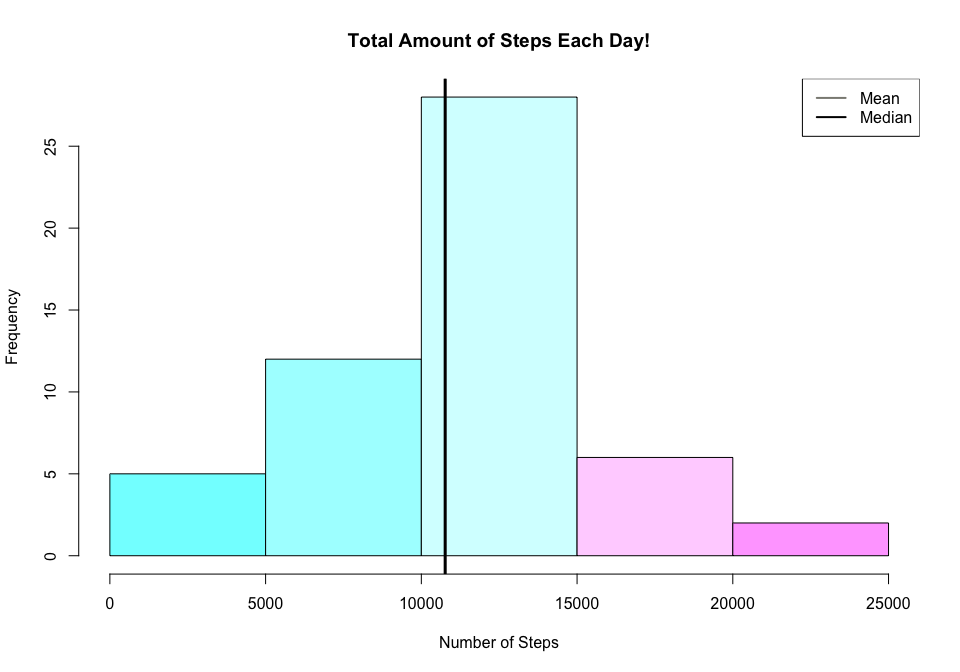
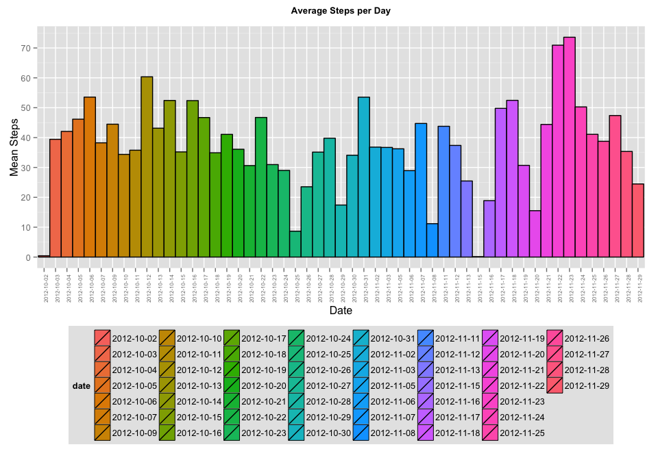

# Reproducible Research: Peer Assessment 1
20 December 2015  
**Goal**: To create a *dynamic document*, in which thourougly explains the steps
taken for analysis on the activity data. Futhermore, the objective includes 
"...[a written] report that answers the questions detailed below. Ultimately, 
[we] will need to complete the entire assignment in a single R markdown document
that can be processed by knitr and be transformed into an HTML file." 
(*Coursera, Roger D. Peng*)

1. Loading and preprocessing the data


```r
# Step 1: Set WD to cloned repository (located on the Computer)
setwd("~/Desktop/RepData_PeerAssessment1")

# Step 2: Unzip file and Read the data into descriptive object
activity <- unzip("activity.zip", "activity.csv")
active_data <- read.csv(activity)

# Step 3: Look and Clean the Data, remove "NA's"
str(active_data) # View data Structure
```

```
## 'data.frame':	17568 obs. of  3 variables:
##  $ steps   : int  NA NA NA NA NA NA NA NA NA NA ...
##  $ date    : Factor w/ 61 levels "2012-10-01","2012-10-02",..: 1 1 1 1 1 1 1 1 1 1 ...
##  $ interval: int  0 5 10 15 20 25 30 35 40 45 ...
```

```r
active_data<- na.omit(active_data) # Removing "NA's"

# Step 4: Re-Peak at the Data Frame to ensure no "NA's"
str(active_data)
```

```
## 'data.frame':	15264 obs. of  3 variables:
##  $ steps   : int  0 0 0 0 0 0 0 0 0 0 ...
##  $ date    : Factor w/ 61 levels "2012-10-01","2012-10-02",..: 2 2 2 2 2 2 2 2 2 2 ...
##  $ interval: int  0 5 10 15 20 25 30 35 40 45 ...
##  - attr(*, "na.action")=Class 'omit'  Named int [1:2304] 1 2 3 4 5 6 7 8 9 10 ...
##   .. ..- attr(*, "names")= chr [1:2304] "1" "2" "3" "4" ...
```

```r
head(active_data)
```

```
##     steps       date interval
## 289     0 2012-10-02        0
## 290     0 2012-10-02        5
## 291     0 2012-10-02       10
## 292     0 2012-10-02       15
## 293     0 2012-10-02       20
## 294     0 2012-10-02       25
```

```r
# Step 5: Use dplyr package for easier manipulation of data frame
library(dplyr) 
```

```
## 
## Attaching package: 'dplyr'
## 
## The following objects are masked from 'package:stats':
## 
##     filter, lag
## 
## The following objects are masked from 'package:base':
## 
##     intersect, setdiff, setequal, union
```

```r
active_data <- tbl_df(active_data) # Create dplyr data frame

# Now, we can see we have a "clean" data frame with 3 variable and 15264 
# observations! We can now move onto the second part of the analysis!
```

2. What is mean total number of steps taken per day?

```r
# Step 1: Load ggplot2 for graphing
library(ggplot2) 

# Step 2: Group Steps by Day, specifically the variable "Date"
str(active_data$date) # See what type of Variable "Date" is in data frame
```

```
##  Factor w/ 61 levels "2012-10-01","2012-10-02",..: 2 2 2 2 2 2 2 2 2 2 ...
```

```r
# Step 3: Histogram of Steps per Day
steps<- ggplot(active_data, aes(x=factor(date), y=steps, fill=date, width=.75))
steps <- steps+ geom_bar(color="black", stat="identity")+ scale_fill_hue(name="date")
steps <- steps+ xlab("Date") + ylab("Amount Steps") + theme(axis.text.x= element_text(angle=90, size=6)) 
steps <- steps + guides(fill=guide_legend(ncol=2))
print(steps)
```

 

```r
# Step 4: Histogram(interval) of Steps each Day
day_step<- aggregate(steps ~ date, active_data, sum) # Group by Date and then Sum the Steps
step <- hist(day_step$steps, xlab= "Number of Steps", main="Total Amount of Steps Each Day!", col="purple")
```

 

```r
print(step) # This Graph shows number of Steps each day as a interval histogram 
```

```
## $breaks
## [1]     0  5000 10000 15000 20000 25000
## 
## $counts
## [1]  5 12 28  6  2
## 
## $density
## [1] 1.886792e-05 4.528302e-05 1.056604e-04 2.264151e-05 7.547170e-06
## 
## $mids
## [1]  2500  7500 12500 17500 22500
## 
## $xname
## [1] "day_step$steps"
## 
## $equidist
## [1] TRUE
## 
## attr(,"class")
## [1] "histogram"
```

```r
# instead of individual dates

# Step 5: Calculate table with mean steps by date
group_date <- group_by(active_data, date) # Group data frame by date
avg_steps_bydate <- summarise(group_date, Mean_Steps= mean(steps, na.rm=TRUE)) 
# Calculated mean by grouped "date" above
```


```r
# Step 6: Print Out visual descriptive, put table and Historgram to represent
# the Mean Number of Steps per day(date)
tbl_df(avg_steps_bydate) # View the Data frame with Date and Average/Mean Steps
```

```
## Source: local data frame [53 x 2]
## 
##          date Mean_Steps
## 1  2012-10-02    0.43750
## 2  2012-10-03   39.41667
## 3  2012-10-04   42.06944
## 4  2012-10-05   46.15972
## 5  2012-10-06   53.54167
## 6  2012-10-07   38.24653
## 7  2012-10-09   44.48264
## 8  2012-10-10   34.37500
## 9  2012-10-11   35.77778
## 10 2012-10-12   60.35417
## ..        ...        ...
```

```r
# Step 7: Add layers to graph
graph<- ggplot(avg_steps_bydate, aes(x=factor(date), y=Mean_Steps, fill=date, width=1))
graph <- graph+ geom_bar(color="black", stat="identity")+ scale_fill_hue(name="date")
graph <- graph+ xlab("Date") + ylab("Mean Steps") + theme(axis.text.x= element_text(angle=90, size=6)) 
graph <- graph+ ggtitle("Average Steps per Day") + theme(legend.position="botton")
graph <- graph+ theme(plot.title = element_text(size=10, face="bold", vjust=2))
graph <- graph + theme(legend.background = element_rect()) 
graph <- graph + theme(legend.background = element_rect(fill="gray90", size=1, linetype="dotted"))
graph <- graph + guides(fill=guide_legend(ncol=10))
print(graph)

# Step 8: Histogram(interval) of Average Steps per Day
avg_step<- aggregate(steps ~ date, active_data, mean) # Group by Date and then Sum the Steps
avg_step <- hist(avg_step$steps, xlab= "Mean Number of Steps", main="Average Amount of Steps per Each Day!", col="orange")
print(avg_step) # This Graph shows number of Steps each day as a interval histogram 
```

```
## $breaks
## [1]  0 10 20 30 40 50 60 70 80
## 
## $counts
## [1]  3  4  5 19 13  6  1  2
## 
## $density
## [1] 0.005660377 0.007547170 0.009433962 0.035849057 0.024528302 0.011320755
## [7] 0.001886792 0.003773585
## 
## $mids
## [1]  5 15 25 35 45 55 65 75
## 
## $xname
## [1] "avg_step$steps"
## 
## $equidist
## [1] TRUE
## 
## attr(,"class")
## [1] "histogram"
```

```r
# instead of individual dates

# Step 7: Now for the median we do the same as above
group_date <- group_by(active_data, date) # Group data frame by date
median_steps <- summarise(group_date, Median_Steps= median(steps))
```



3. What is the average daily activity pattern?


4. Imputing missing values


5. Are there differences in activity patterns between weekdays and weekends?
