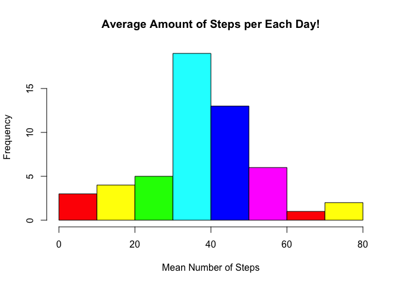
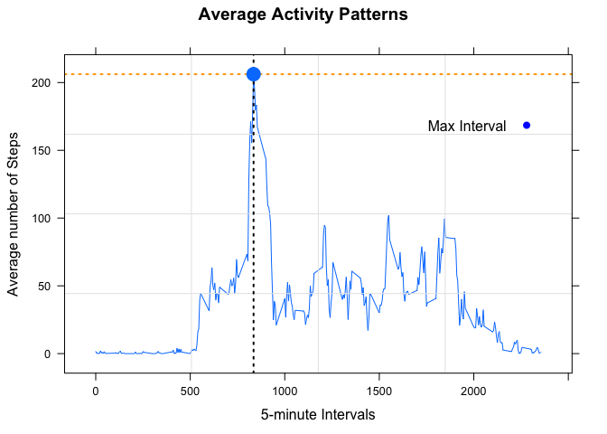
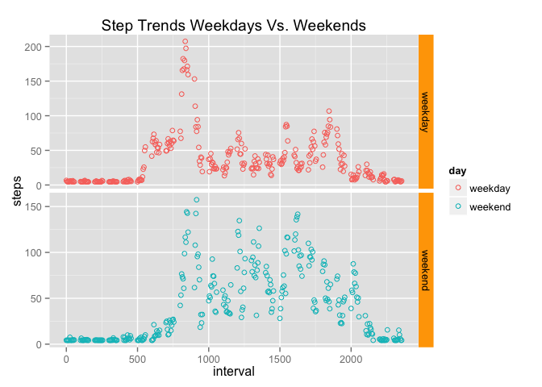

# Reproducible Research: Peer Assessment 1
20 December 2015  
**Goal**: To create a *dynamic document*, that thourougly explains step-by-step 
analysis of the activity data. Futhermore, the objective includes 
"...[a written] report that answers the questions detailed below. Ultimately, 
[we] will need to complete the entire assignment in a single R markdown document
that can be processed by knitr and be transformed into an HTML file." 
(*Coursera, Roger D. Peng*)

1. Loading and preprocessing the data


```r
# Step 1: Set WD to cloned repository (located on the Computer)
setwd("~/Desktop/RepData_PeerAssessment1")

# Step 2: Unzip file and Read the data into descriptive object
activity <- unzip("activity.zip", "activity.csv")
active_data <- read.csv(activity) # Data to Manipulate
active <- read.csv(activity) # Raw Data

# Step 3: Look and Clean the Data, remove "NA's"
str(active_data) # View data Structure
```

```
## 'data.frame':	17568 obs. of  3 variables:
##  $ steps   : int  NA NA NA NA NA NA NA NA NA NA ...
##  $ date    : Factor w/ 61 levels "2012-10-01","2012-10-02",..: 1 1 1 1 1 1 1 1 1 1 ...
##  $ interval: int  0 5 10 15 20 25 30 35 40 45 ...
```

```r
active_data<- na.omit(active_data) # Removing "NA's"

# Step 4: Re-Peak at the Data Frame to ensure no "NA's"
str(active_data)
```

```
## 'data.frame':	15264 obs. of  3 variables:
##  $ steps   : int  0 0 0 0 0 0 0 0 0 0 ...
##  $ date    : Factor w/ 61 levels "2012-10-01","2012-10-02",..: 2 2 2 2 2 2 2 2 2 2 ...
##  $ interval: int  0 5 10 15 20 25 30 35 40 45 ...
##  - attr(*, "na.action")=Class 'omit'  Named int [1:2304] 1 2 3 4 5 6 7 8 9 10 ...
##   .. ..- attr(*, "names")= chr [1:2304] "1" "2" "3" "4" ...
```

```r
head(active_data)
```

```
##     steps       date interval
## 289     0 2012-10-02        0
## 290     0 2012-10-02        5
## 291     0 2012-10-02       10
## 292     0 2012-10-02       15
## 293     0 2012-10-02       20
## 294     0 2012-10-02       25
```

```r
# Step 5: Use dplyr package for easier manipulation of data frame
library(dplyr) 
```

```
## 
## Attaching package: 'dplyr'
## 
## The following objects are masked from 'package:stats':
## 
##     filter, lag
## 
## The following objects are masked from 'package:base':
## 
##     intersect, setdiff, setequal, union
```

```r
active_data <- tbl_df(active_data) # Create dplyr data frame

# Now, we can see we have a "clean" data frame with 3 variables and 15264 
# observations! We can now move onto the second part of the analysis!
```

2. What is mean total number of steps taken per day?

```r
# Step 1: Load ggplot2 for graphing
library(ggplot2) 

# Step 2: Group Steps by Day, specifically the variable "Date"
str(active_data$date) # See what type of Variable "Date" is in data frame
```

```
##  Factor w/ 61 levels "2012-10-01","2012-10-02",..: 2 2 2 2 2 2 2 2 2 2 ...
```

```r
# Step 3: Histogram of Steps per Day
steps<- ggplot(active_data, aes(x=factor(date), y=steps, fill=date, width=.75))
steps <- steps+ geom_bar(color="black", stat="identity")+ scale_fill_hue(name="date")
steps <- steps+ xlab("Date") + ylab("Amount Steps") + theme(axis.text.x= element_text(angle=90, size=6)) 
steps <- steps + guides(fill=guide_legend(ncol=2)) + scale_y_continuous(breaks = seq(0, 25000, by = 1500))
print(steps)
```

 

```r
# Step 4: Histogram(interval) of Steps each Day
day_step<- aggregate(steps ~ date, active_data, sum) # Group by Date and then Sum the Steps
step <- hist(day_step$steps, xlab= "Number of Steps", main="Total Amount of Steps Each Day!", col=cm.colors(6))
abline(v = mean(day_step$steps), col = "ivory4", lwd = 2)
abline(v = median(day_step$steps), col = "black", lwd = 3)
legend(x = "topright", c("Mean", "Median"),col = c("ivory4", "black"), lwd = c(2, 2, 2))
```

 

```r
print(step) 
```

```
## $breaks
## [1]     0  5000 10000 15000 20000 25000
## 
## $counts
## [1]  5 12 28  6  2
## 
## $density
## [1] 1.886792e-05 4.528302e-05 1.056604e-04 2.264151e-05 7.547170e-06
## 
## $mids
## [1]  2500  7500 12500 17500 22500
## 
## $xname
## [1] "day_step$steps"
## 
## $equidist
## [1] TRUE
## 
## attr(,"class")
## [1] "histogram"
```

```r
# This Graph shows number of Steps each day as a larger interval histogram 
# instead of individual dates interval.
```

##**Mean**

```r
# Step 5: Calculate table with mean steps by date
group_date <- group_by(active_data, date) # Group data frame by date
avg_steps_bydate <- summarise(group_date, Mean_Steps= mean(steps, na.rm=TRUE)) 
# Calculated mean by grouped "date" above

# Step 6: Print Out visual descriptive, put table and Historgram to represent
# the Mean Number of Steps per day(date)
tbl_df(avg_steps_bydate) # View the Data frame with Date and Average/Mean Steps
```

```
## Source: local data frame [53 x 2]
## 
##          date Mean_Steps
## 1  2012-10-02    0.43750
## 2  2012-10-03   39.41667
## 3  2012-10-04   42.06944
## 4  2012-10-05   46.15972
## 5  2012-10-06   53.54167
## 6  2012-10-07   38.24653
## 7  2012-10-09   44.48264
## 8  2012-10-10   34.37500
## 9  2012-10-11   35.77778
## 10 2012-10-12   60.35417
## ..        ...        ...
```

```r
# Step 7: Add layers to graph
graph<- ggplot(avg_steps_bydate, aes(x=factor(date), y=Mean_Steps, fill=date, width=1))
graph <- graph+ geom_bar(color="black", stat="identity")+ scale_fill_hue(name="date")
graph <- graph+ xlab("Date") + ylab("Mean Steps") + theme(axis.text.x= element_text(angle=90, size=6)) 
graph <- graph+ ggtitle("Average Steps per Day") + theme(legend.position="bottom")
graph <- graph+ theme(plot.title = element_text(size=10, face="bold", vjust=2))
graph <- graph + theme(legend.background = element_rect()) 
graph <- graph + theme(legend.background = element_rect(fill="gray90", size=.75, linetype="dotted"))
graph <- graph + guides(fill=guide_legend(ncol=8)) + scale_y_continuous(breaks = seq(0, 80, by = 10))
print(graph)
```

 


```r
# Step 8: Histogram(interval) of Average Steps per Day
avg_step<- aggregate(steps ~ date, active_data, mean) # Group by Date and then Sum the Steps
avg_step <- hist(avg_step$steps, xlab= "Mean Number of Steps", main="Average Amount of Steps per Each Day!",  col=rainbow(6))
```

 

```r
print(avg_step) # This Graph shows number of Steps each day as a interval histogram 
```

```
## $breaks
## [1]  0 10 20 30 40 50 60 70 80
## 
## $counts
## [1]  3  4  5 19 13  6  1  2
## 
## $density
## [1] 0.005660377 0.007547170 0.009433962 0.035849057 0.024528302 0.011320755
## [7] 0.001886792 0.003773585
## 
## $mids
## [1]  5 15 25 35 45 55 65 75
## 
## $xname
## [1] "avg_step$steps"
## 
## $equidist
## [1] TRUE
## 
## attr(,"class")
## [1] "histogram"
```

```r
# instead of individual dates
```

##**Median**

```r
# Step 9: Now for the median we do the same as above
median_step<- aggregate(steps ~ date, active_data, median) # Group by Date and then Sum the Steps
median_step <- hist(median_step$steps, xlab= "Median Number of Steps", main="Median Steps per Each Day!", col="violet")
```

 

```r
print(median_step) # This Graph shows Median, where middle value falls
```

```
## $breaks
## [1] -1  0
## 
## $counts
## [1] 53
## 
## $density
## [1] 1
## 
## $mids
## [1] -0.5
## 
## $xname
## [1] "median_step$steps"
## 
## $equidist
## [1] TRUE
## 
## attr(,"class")
## [1] "histogram"
```

###The Analyzed **Mean** amount of Steps is: 
[1] 10766.19

### and the analyzed **Median** amount of Steps is: 
[1] 10765


3. What is the average daily activity pattern?


```r
# Step 1: Load lattice library for Graph
library(lattice)

# Step 2: We want to a time series plot, so we need to group by Interval Type
interval_avg = aggregate(steps~interval, active, mean) # Group by interval

# Step 3: Make Plot, we want: Average Steps across all days(y) vs Time Invervals(x)
xyplot(interval_avg$steps ~interval_avg$interval, data=interval_avg, type=c("l", "g"),
       ylab="Average number of Steps", xlab="5-minute Intervals", main="Average Activity Patterns")
```

 

4. Which 5-minute interval, on average across all the days in the dataset, contains the maximum number of steps?


```r
# Step 1: Obtain Maximum Values
y_max= max(interval_avg$steps) # Max of the Average Number of Steps
print(y_max)
```

```
## [1] 206.1698
```

```r
x_value= interval_avg[interval_avg$steps==y_max,1] # Max of the Interval Matching Max Steps
print(x_value)
```

```
## [1] 835
```

```r
# Step 2: Plot this point on the Time Series Plot
xyplot(interval_avg$steps~interval_avg$interval, data=interval_avg, type=c("l", "g"),
       ylab="Average number of Steps", xlab="5-minute Intervals", main="Average Activity Patterns", 
       panel=function(...){panel.lines(interval_avg$interval,interval_avg$steps)
                           panel.grid(...)
                           panel.abline(v=x_value, lty = "dotted", col = "black", lwd=2)
                           panel.abline(h=y_max, lty = "dotted", col = "orange", lwd=2)
                           panel.points(x_value, y_max, cex=2, pch=16)
                           },
                          par.settings=list(superpose.symbol=list(col=c("blue", "blue"), 
                                            fill=c("blue", "blue"), pch=c(16, 16), cex=1)),

                          auto.key = list(points=TRUE, x = 0.7, y = 0.8, text = c("Max Interval"))
       )
```

 

### Here we were able to see the five minute interval at point
[1] 835

### matches the maximum value of average steps at value
[1] 206.1698


5. Calculate and report the total number of missing values in the dataset

```r
sum(is.na(active)) # Amount of all rows with "NA"
```

```
## [1] 2304
```

```r
# This shows 2304 lines were omited in previous anaylsis.
```

6. Devise a strategy for filling in all of the missing values in the dataset. The strategy does not need to be sophisticated. For example, you could use the mean/median for that day, or the mean for that 5-minute interval, etc.

```r
# Stragety 1: One method would be to take the Median of the Time series, which 
# is grouped by interval and means. This value to replace to "NA's" in the original data set

# Step 1: Recall the Median value by 5-Minute Interval
middle<- median(interval_avg$steps)
middle # We can see the median value is 34.11321
```

```
## [1] 34.11321
```

```r
# Step 2: Replace all the "NA's" with this Median value and re-compute analysis
df_missing= active # Set Orginal aat frame with "NA's" equal to new variable
df_missing$steps[is.na(df_missing$steps)]= median(interval_avg$steps)
str(df_missing) # View data frame 
```

```
## 'data.frame':	17568 obs. of  3 variables:
##  $ steps   : num  34.1 34.1 34.1 34.1 34.1 ...
##  $ date    : Factor w/ 61 levels "2012-10-01","2012-10-02",..: 1 1 1 1 1 1 1 1 1 1 ...
##  $ interval: int  0 5 10 15 20 25 30 35 40 45 ...
```

```r
head(df_missing)
```

```
##      steps       date interval
## 1 34.11321 2012-10-01        0
## 2 34.11321 2012-10-01        5
## 3 34.11321 2012-10-01       10
## 4 34.11321 2012-10-01       15
## 5 34.11321 2012-10-01       20
## 6 34.11321 2012-10-01       25
```


```r
# Stragety 2: Replace all missing values with Column Mean (Average Steps)
# Note the Column mean is obtained by:
mean(active$steps, na.rm=TRUE)
```

```
## [1] 37.3826
```

```r
# Notice the Resulting value 37.3826

#Step 1:
df= active # Set Orginal aat frame with "NA's" equal to new variable
df$steps[is.na(df$steps)]= mean(df$steps, na.rm=TRUE) # Set all "NA's" to mean value
str(df) # View the data
```

```
## 'data.frame':	17568 obs. of  3 variables:
##  $ steps   : num  37.4 37.4 37.4 37.4 37.4 ...
##  $ date    : Factor w/ 61 levels "2012-10-01","2012-10-02",..: 1 1 1 1 1 1 1 1 1 1 ...
##  $ interval: int  0 5 10 15 20 25 30 35 40 45 ...
```

```r
head(df)
```

```
##     steps       date interval
## 1 37.3826 2012-10-01        0
## 2 37.3826 2012-10-01        5
## 3 37.3826 2012-10-01       10
## 4 37.3826 2012-10-01       15
## 5 37.3826 2012-10-01       20
## 6 37.3826 2012-10-01       25
```

7. Make a histogram of the total number of steps taken each day and Calculate and report the mean and median total number of steps taken per day.

```r
# Use the Median created data frame because when data is skewed the Median is a 
# Better representation of the data

# Step 1: Load ggplot2 for graphing
library(ggplot2) 
# Step 2: Histogram Steps per Day
sum_missing_steps<- aggregate(steps ~ date, df_missing, sum) # Group by Date and then Sum the Steps
step <- hist(sum_missing_steps$steps, xlab= "Number of Steps", main="Total Amount of Steps Each Day!", col=cm.colors(6))
abline(v = mean(sum_missing_steps$steps), col = "ivory4", lwd = 2)
abline(v = median(sum_missing_steps$steps), col = "black", lwd = 3)
legend(x = "topright", c("Mean", "Median"),col = c("ivory4", "black"), lwd = c(2, 2, 2))
```

 

### We should notice the similiarties between our original steps graph, without NA,
### and current graphs with NA replaced values by Median. In our original we had  
### 53 observations after grouping and in our modified we have 61 observations after grouping. 
### The original values produced:

```r
mean(day_step$steps) # Original Mean Steps
```

```
## [1] 10766.19
```

```r
median(day_step$steps) # Original Median Steps
```

```
## [1] 10765
```

### The new values produced:


```r
mean(sum_missing_steps$steps) # New Mean Steps
```

```
## [1] 10642.7
```

```r
median(sum_missing_steps$steps) # New Median Steps
```

```
## [1] 10395
```


```r
# Step 3: Histogram of Average Steps per Day
replace_missing<- aggregate(steps ~ date, df_missing, mean) # Group by Date and then Sum the Steps
replaced_step <- hist(replace_missing$steps, xlab= "Mean Number of Steps", main="Average Amount of Steps per Each Day!",  col=rainbow(6))
```

 

```r
print(replaced_step) # This Graph shows number of Steps each day as a interval histogram 
```

```
## $breaks
## [1]  0 10 20 30 40 50 60 70 80
## 
## $counts
## [1]  3  4  5 27 13  6  1  2
## 
## $density
## [1] 0.004918033 0.006557377 0.008196721 0.044262295 0.021311475 0.009836066
## [7] 0.001639344 0.003278689
## 
## $mids
## [1]  5 15 25 35 45 55 65 75
## 
## $xname
## [1] "replace_missing$steps"
## 
## $equidist
## [1] TRUE
## 
## attr(,"class")
## [1] "histogram"
```

```r
# instead of individual dates
```

### The original values produced:

```r
avg_step<- aggregate(steps ~ date, active_data, mean) 
mean(avg_step$step) # Original Mean Steps
```

```
## [1] 37.3826
```

```r
median(avg_step$step) # Original Median Steps
```

```
## [1] 37.37847
```

### The new values produced:

```r
mean(replace_missing$steps) # New Mean Steps
```

```
## [1] 36.95383
```

```r
median(replace_missing$steps) # New Median Steps
```

```
## [1] 36.09375
```

### We should notice the similiarties between our original steps graph, without
### NA's and current graphs with NA replaced values by Median.

7. Imputing missing values, Do these values differ from the estimates from the first part of the assignment? What is the impact of imputing missing data on the estimates of the total daily number of steps?

### No, the assigned Median Values to the Original Data Set does not change the values by much.
### Without NA's,  the Total Number of Steps was 10766.19 and the Total Number of Steps
### with replaced NA's was 10642.7. The diference is:


```r
10766.19 -10642.7 # Difference of 123.49 Steps
```

```
## [1] 123.49
```

### The addition of NA's impacted the data resulting in averages and medians to be slightly smaler.

8. Are there differences in activity patterns between weekdays and weekends? Create a panel plot comparing the average number of steps taken per 5-minute interval across weekdays and weekends?
(Use the dataset with the filled-in missing values for this part.)


```r
# Step1: Define WeekDays and WeekEnds
patterns= df_missing
patterns$day <- c("weekday", "weekend") # Add Column for Week-type
patterns$day <- weekdays(as.Date(patterns$date)) # Fill in the Column
patterns[patterns$day == "Monday",]$day = "weekday"
patterns[patterns$day == "Tuesday",]$day = "weekday"
patterns[patterns$day == "Wednesday",]$day = "weekday"
patterns[patterns$day == "Thursday",]$day = "weekday"
patterns[patterns$day == "Friday",]$day = "weekday"
patterns[patterns$day == "Saturday",]$day = "weekend"
patterns[patterns$day == "Sunday",]$day = "weekend"
str(patterns)
```

```
## 'data.frame':	17568 obs. of  4 variables:
##  $ steps   : num  34.1 34.1 34.1 34.1 34.1 ...
##  $ date    : Factor w/ 61 levels "2012-10-01","2012-10-02",..: 1 1 1 1 1 1 1 1 1 1 ...
##  $ interval: int  0 5 10 15 20 25 30 35 40 45 ...
##  $ day     : chr  "weekday" "weekday" "weekday" "weekday" ...
```

```r
patterns[, "day"] <- as.factor(patterns[, "day"]) # Turn into a factor w/ two levels
str(patterns)
```

```
## 'data.frame':	17568 obs. of  4 variables:
##  $ steps   : num  34.1 34.1 34.1 34.1 34.1 ...
##  $ date    : Factor w/ 61 levels "2012-10-01","2012-10-02",..: 1 1 1 1 1 1 1 1 1 1 ...
##  $ interval: int  0 5 10 15 20 25 30 35 40 45 ...
##  $ day     : Factor w/ 2 levels "weekday","weekend": 1 1 1 1 1 1 1 1 1 1 ...
```

```r
# Step 2: Create Graph 
library(ggplot2)
pattern2<- aggregate(steps~interval+ day, patterns, mean) # Group by interval

pattern_plot <- ggplot(pattern2, aes(x=interval, y=steps)) + geom_point(shape=1)  + facet_grid(day ~.)

pattern_plot
```

 


